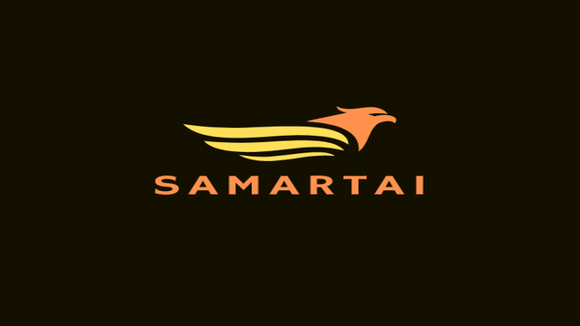

  

<h1 align="center">SamartAI</h1>

  <b>Dual-Platform AI Assistant for Scholarship Discovery & Guidance</b> 
  Web Application + Telegram Bot

  🌍 Inclusive • 🤖 AI-Powered • 🎓 Education-Focused

---

## 🌍 Project Overview

**SamartAI** is a dual-platform AI-powered assistant (Web Application + Telegram Bot) designed to help students—especially from **rural, semi-urban, and underserved communities**—discover government scholarships, understand eligibility, and apply with confidence.

Instead of navigating complex government portals, students can interact with SamartAI either through a **modern web interface** or a **simple chat-based experience**, making scholarship access **inclusive, flexible, and scalable**.

---

## ❗ Problem Statement

Despite the availability of numerous government scholarships, many students fail to benefit due to:

- Information scattered across multiple government portals  
- Complex eligibility rules and official language  
- Lack of step-by-step application guidance  
- Language and digital literacy barriers  
- Limited access to laptops or high-speed internet  

Most existing systems only **list information** — they do **not guide or explain**.

---

## 💡 Solution: SamartAI (Dual-Platform Approach)

SamartAI addresses this gap using a **dual access model** powered by a **single AI brain**.

### 🔹 Web Platform (Rich Experience)
- Clean and structured UI
- Ideal for desktop & mobile users
- Useful for demos, institutions, and NGOs

### 🔹 Telegram Bot (Low-Barrier Access)
- Works on basic smartphones
- No installation or learning curve
- Optimized for low-bandwidth environments
- Familiar chat-based interaction

👉 **One AI system. Two access paths.**

---

## 🧠 What SamartAI Does

- 🔍 Identifies scholarships based on student profile  
- 🎓 Clearly explains benefits (fees, stipend, hostel, etc.)  
- 📝 Guides students step-by-step through application processes  
- 💬 Conversational interaction (chat-based)  
- 🌐 Works on Web  
- 🤖 Works on Telegram Bot  

---

## 🏗️ System Architecture (High-Level)
                ┌──────────────┐
                │   Web App    │
                │ (React UI)   │
                └──────┬───────┘
                       │
User ───► Web / Telegram ───► AI Backend ───► Scholarship Knowledge Base
                       │
                ┌──────┴───────┐
                │ Telegram Bot │
                │  (Chat UI)   │
                └──────────────┘

---

## ⚙️ Technical Architecture

### Frontend (Web)
- React + TypeScript + Tailwind CSS  
- Pages:
  - Home
  - Scholarship Discovery
  - How It Works
  - Features
  - AI Technology
  - Impact
  - Future Roadmap
  - About & Contact  

Accessible, responsive, and beginner-friendly.

---

### Telegram Bot
- Built using Python  
- Conversational flow:
  1. User asks a question  
  2. SamartAI asks clarifying details  
  3. Relevant scholarships are returned  

Designed for rural and mobile-only users.

---

### Backend & AI Layer
- Python + Flask  
- Shared AI logic for Web & Telegram
- Handles:
  - Natural language understanding  
  - Eligibility-based filtering  
  - Duplicate removal  
  - Context-aware responses  

---

### Data Layer
- Verified scholarship database  
- Structured metadata:
  - Eligibility
  - Category
  - Benefits
  - Application steps  

Easily extendable to other states and central schemes.

---

## 📅 Development Journey

- **Day 0:** Problem identification & planning  
- **Day 1:** Scholarship data collection & structuring  
- **Day 2:** AI scholarship matching engine  
- **Day 3:** Human-friendly response design  
- **Day 4:** Interactive assistant behavior  
- **Day 5:** Web app + Telegram bot deployment  

---

## ✅ Current Capabilities

- Dual access: Web + Telegram  
- AI-driven scholarship discovery  
- Verified data sources  
- Conversational guidance  
- Scalable system design  

---

## 🌱 Social Impact

- Helps first-generation learners  
- Reduces scholarship drop-offs  
- Supports rural & low-bandwidth users  
- Empowers parents, volunteers, and NGOs  
- Promotes inclusive access to education  

---

## 🔮 Future Roadmap

- WhatsApp integration  
- Voice-only interaction mode  
- OCR-based document verification  
- Multilingual expansion (Telugu, Hindi, etc.)  
- Deadline reminders & notifications  
- Career and exam guidance  

---

## 🏁 Conclusion

SamartAI is an **accessibility-first, dual-platform AI solution** ensuring that no student misses educational opportunities due to lack of guidance or technology barriers.

By combining a **modern web experience** with a **low-friction chat interface**, SamartAI demonstrates how AI can deliver **real social impact at scale**.

---

## 🔥 Judge-Winning One-Liner

> **“SamartAI uses one AI brain with two access paths—Web and Telegram—to ensure every student, regardless of resources, can access scholarships easily.”**

