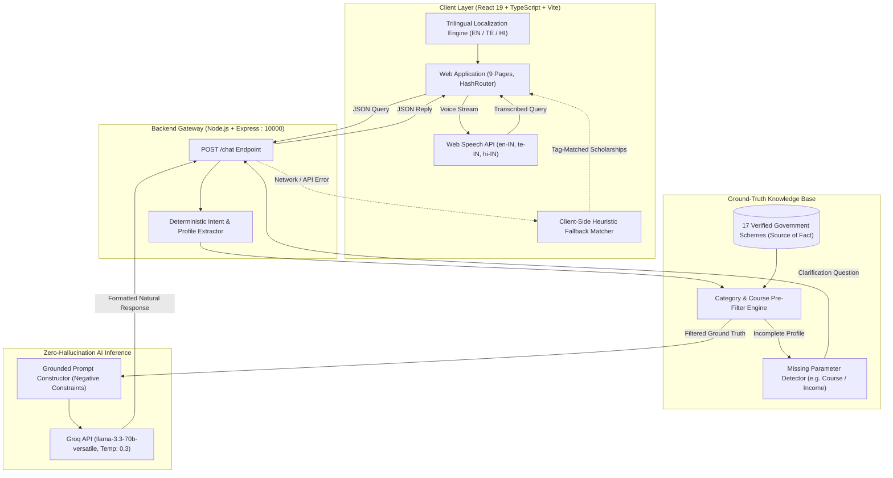

<div align="center">


# 🎓 SamartAI — Accessibility-First Conversational Scholarship Intelligence Platform

**Dual-Platform AI Ecosystem (Web & Telegram) Empowering Rural and Semi-Urban Students with Multilingual Intent Understanding, Web Speech Voice Input & Fact-Grounded LLaMA-3.3-70B**

[](https://react.dev)
[](https://www.typescriptlang.org)
[](https://vitejs.dev)
[](https://tailwindcss.com)
[](https://nodejs.org)
[](https://expressjs.com)
[](https://groq.com)
[](https://developer.mozilla.org/en-US/docs/Web/API/Web_Speech_API)
[](LICENSE)

<br />


</div>

---

## 📑 Executive Summary

Every year, **over ₹4,500 Crores in government and institutional scholarships go unclaimed** across India. The root cause is not a lack of funding, but an acute **accessibility and information asymmetry crisis**:
1. **Digital Literacy & Interface Complexity**: Rural and first-generation college students find multi-step government portals (`jnanabhumi.ap.gov.in`, `scholarships.gov.in`) intimidating and difficult to navigate.
2. **Language Barriers**: Most portals are published exclusively in complex administrative English or formal terminology that obscures basic eligibility criteria.
3. **Typing & Accessibility Limitations**: Many rural students rely on mobile devices with limited typing comfort and need hands-free speech interactions in their mother tongue.
4. **AI Hallucination Hazards**: Standard generative AI chatbots frequently invent fictitious government schemes, quote incorrect deadlines, or hallucinate eligibility amounts, misguiding vulnerable students.

**SamartAI** solves this through an **accessibility-first conversational AI platform** available via a modern **Web Application** and a low-bandwidth **Telegram Bot**. Built on **React 19, TypeScript, and a Node.js/Express backend**, it utilizes **Groq's ultra-low-latency LLaMA 3.3 70B model** (<300ms) with a **strict anti-hallucination fact-grounding pipeline**, **Web Speech API voice input**, and **trilingual support (English, Telugu తెలుగు, Hindi हिन्दी)** across a curated database of verified government scholarship schemes.

---

## 🎯 Problem Statement & Target Beneficiaries

* **Target Demographics**: Students from rural and semi-urban communities, first-generation scholars, SC/ST, BC, Minority, Brahmin Welfare, and Building & Other Construction (BOC) worker families.
* **Core Pain Points Solved**:
  * Eliminates complex multi-field filter forms in favor of natural conversational queries (e.g., *"I am doing B.Tech, SC category, income under 2 lakhs, what fee reimbursement can I get?"*).
  * Provides instant spoken-word voice search in native dialects (Telugu and Hindi) via the browser's Web Speech API.
  * Guarantees **100% verified ground-truth data**: The AI is mathematically constrained to only speak about verified government schemes.
  * Features a robust **client-side offline fallback matcher** that continues serving scholarship matches even if the backend LLM service is temporarily unreachable.

---

## 🏛️ System Architecture

SamartAI separates user intent understanding, deterministic ground-truth filtering, and generative natural language synthesis into a modular, decoupled pipeline:


```mermaid
flowchart TD
    subgraph ClientLayer ["Client Layer (React 19 + TypeScript + Vite)"]
        WebUI["Web Application (9 Pages, HashRouter)"]
        Voice["Web Speech API (en-IN, te-IN, hi-IN)"]
        Lang["Trilingual Localization Engine (EN / TE / HI)"]
        Fallback["Client-Side Heuristic Fallback Matcher"]
    end

    subgraph Gateway ["Backend Gateway (Node.js + Express : 10000)"]
        ChatEndpoint["POST /chat Endpoint"]
        ProfileParser["Deterministic Intent & Profile Extractor"]
    end

    subgraph TruthEngine ["Ground-Truth Knowledge Base"]
        MasterDB[("17 Verified Government Schemes (Source of Fact)")]
        Matcher["Category & Course Pre-Filter Engine"]
        FollowUp["Missing Parameter Detector (e.g. Course / Income)"]
    end

    subgraph LLM ["Zero-Hallucination AI Inference"]
        PromptBuilder["Grounded Prompt Constructor (Negative Constraints)"]
        Groq["Groq API (llama-3.3-70b-versatile, Temp: 0.3)"]
    end

    WebUI -->|Voice Stream| Voice
    Voice -->|Transcribed Query| WebUI
    Lang --> WebUI
    WebUI -->|JSON Query| ChatEndpoint

    ChatEndpoint --> ProfileParser
    ProfileParser --> Matcher
    MasterDB --> Matcher

    Matcher -->|Incomplete Profile| FollowUp
    FollowUp -->|Clarification Question| ChatEndpoint

    Matcher -->|Filtered Ground Truth| PromptBuilder
    PromptBuilder --> Groq
    Groq -->|Formatted Natural Response| ChatEndpoint
    ChatEndpoint -->|JSON Reply| WebUI

    ChatEndpoint -.->|Network / API Error| Fallback
    Fallback -.->|Tag-Matched Scholarships| WebUI
```

---

## 🛡️ Anti-Hallucination & Fact-Grounding Pipeline

To safeguard vulnerable students from inaccurate financial aid guidance, SamartAI enforces a **strict three-stage anti-hallucination architecture**:

### 1. Deterministic Profile Extraction (`extractProfile`)
Before invoking any Large Language Model, the incoming query is parsed via deterministic lexical pattern matchers to extract verified student attributes:
* **Caste / Reservation Category**: `SC`, `ST`, `BC`, `OC`
* **Academic Course**: `BTech`, `BCom`, `Degree`, `MBA`, `MCA`, `Masters`, `PhD`
* **Study Abroad / Overseas Interest**: `abroad`, `overseas`, `foreign`

### 2. Ground-Truth Pre-Filtering (`matchScholarships`)
The extracted profile is filtered strictly against the internal immutable database of verified schemes:
$$\mathcal{S}_{\text{matched}} = \{ s \in \mathcal{S}_{\text{master}} \mid (\mathcal{C}_{\text{profile}} \cap s.\text{category} \neq \emptyset) \land (\mathcal{K}_{\text{profile}} \cap s.\text{courses} \neq \emptyset) \}$$

If a critical attribute (such as academic course) is missing, the backend **bypasses the LLM entirely** and immediately returns a targeted follow-up question:
> *"What course are you studying? (BTech, BCom, Degree, etc.)"*

### 3. Constrained Prompt Construction & Negative Prompting
When invoking the Groq LLaMA 3.3 70B model, the prompt is injected with **immutable ground-truth context and strict negative constraints**:
```text
You are SamartAI, a government scholarship assistant.

IMPORTANT RULES:
- Use ONLY the scholarships listed below
- Do NOT invent schemes
- Explain eligibility clearly
- Ask follow-up questions if income is missing

SCHOLARSHIPS:
{Filtered Candidate Schemes with verified benefits, income limits, and links}

USER QUESTION:
"{User's Natural Language Input}"

ANSWER:
```

---

## 🎙️ Web Speech API & Trilingual Localization

### 1. Native Voice Input (`MicrophoneButton.tsx`)
* Seamlessly activates the browser's native `SpeechRecognition` / `webkitSpeechRecognition` engine.
* Automatically synchronizes recognition language codes with the user's active session:
  * English: `en-IN`
  * Telugu: `te-IN`
  * Hindi: `hi-IN`
* Features real-time visual feedback with pulsing animated audio wave rings and automatic error boundary handling.

### 2. Complete Trilingual Dictionary (`constants.ts`)
* Zero external localization dependencies: Implements a lightweight, type-safe multilingual translation dictionary covering all UI labels, navigation links, explanations, and error messages.
* Instant client-side recomposition: Toggling between English, Telugu (తెలుగు), and Hindi (हिन्दी) updates the entire interface with zero network latency.

---

## 📚 Master Scholarship Knowledge Base (17 Schemes)

SamartAI contains verified, accurate data on Andhra Pradesh state and national government scholarship schemes:

| Scheme Name | Providing Body | Target Category | Maximum Benefit | Income Ceiling | Official Portal |
| :--- | :--- | :--- | :--- | :--- | :--- |
| **Jagananna Vidya Deevena (RTF)** | AP State Govt | SC / ST / BC / Kapu / EBC / Minority | Full Tuition Fee Reimbursement | < ₹2,50,000 | [JnanaBhumi](https://jnanabhumi.ap.gov.in/) |
| **Jagananna Vasathi Deevena (MTF)** | AP State Govt | SC / ST / BC / Kapu / EBC / Minority | ₹10,000 – ₹20,000 / year (Hostel/Food) | < ₹2,50,000 | [JnanaBhumi](https://jnanabhumi.ap.gov.in/) |
| **Ambedkar Overseas Vidya Nidhi** | AP State Govt | SC / ST Students | Up to ₹15,00,000 for Masters / PhD Abroad | < ₹6,00,000 | [JnanaBhumi](https://jnanabhumi.ap.gov.in/) |
| **NSP Post Matric Scholarship** | Central Govt | Minority Communities (Muslim, Christian, Sikh) | Tuition + Maintenance Allowance | < ₹2,00,000 | [National Scholarship Portal](https://scholarships.gov.in/) |
| **Bharati Scheme (Graduation)** | AP Brahmin Corp | Brahmin / EWS | ₹15,000 one-time financial aid | < ₹3,00,000 | [AP Brahmin Portal](https://apadapter.ap.gov.in/) |
| **Bharati Scheme (Professional)** | AP Brahmin Corp | Brahmin / EWS (BTech, MBBS, Law) | ₹20,000 one-time financial aid | < ₹3,00,000 | [AP Brahmin Portal](https://apadapter.ap.gov.in/) |
| **Bharati Scheme (CA / ICWA)** | AP Brahmin Corp | Brahmin Students pursuing CA / CMA | ₹15,000 (Inter) / ₹30,000 (Final) | < ₹3,00,000 | [AP Brahmin Portal](https://apadapter.ap.gov.in/) |
| **Veda Vyasa Scheme** | AP Brahmin Corp | Vedic Education Students | ₹5,000 – ₹10,000 / year | < ₹3,00,000 | [AP Brahmin Portal](https://apadapter.ap.gov.in/) |
| **BOC Workers Children Scholarship** | AP Labour Dept | Registered Construction Workers' Children | ₹2,000 – ₹20,000 per academic year | Valid Labour Card | [AP Labour Portal](https://labour.ap.gov.in/) |
| **Sanction of Laptops Scheme** | Differently Abled Dept | Physically Challenged Students | Free High-Configuration Laptop | Differently Abled ID | [Differently Abled Dept](https://apdascac.ap.gov.in/) |

---

## 📱 9-Page Router Architecture

The web application is structured with `react-router-dom` using `HashRouter` for reliable static and single-page hosting:

| Route | Page Component | Functional Scope & Architectural Logic |
| :--- | :--- | :--- |
| `#/` | `HomePage.tsx` | Hero section, trust indicators, feature cards, and instant CTA buttons. |
| `#/discovery` | `ScholarshipDiscoveryPage.tsx` | Main interactive conversational AI chat window, microphone button, quick prompt chips, and dynamic scholarship cards. |
| `#/about` | `AboutPage.tsx` | Social mission, focus on rural accessibility, educational equity, and team background. |
| `#/how-it-works` | `HowItWorksPage.tsx` | 4-step visual workflow guide: Speak/Type $\rightarrow$ Intent Extraction $\rightarrow$ Grounded Match $\rightarrow$ Direct Apply. |
| `#/features` | `FeaturesPage.tsx` | In-depth breakdown of trilingual support, Web Speech API, anti-hallucination guarantees, and offline fallback. |
| `#/technology` | `AiTechnologyPage.tsx` | Explains Groq LLaMA 3.3 70B integration, low-temperature prompt constraints, and sub-300ms inference. |
| `#/impact` | `ImpactPage.tsx` | Quantifiable social impact metrics, rural outreach projections, and user case studies. |
| `#/roadmap` | `FutureRoadmapPage.tsx` | Development timeline: Telegram bot launch, WhatsApp Business API integration, DigiLocker automated document pulling. |
| `#/contact` | `ContactPage.tsx` | Contact forms, partnership inquiries for academic institutions and NGOs, and direct feedback channel. |

---

## 📂 Project Repository Structure

```
SamartAI_Main/
├── .github/workflows/ci.yml          # Automated CI lint & test
├── backend/                          # Node.js & Express API Gateway
│   ├── package.json                  # Express, CORS, Dotenv dependencies
│   ├── server.js                     # Anti-hallucination pipeline & Groq LLM integration
│   └── kv.js                         # Key-value store configuration
├── components/                       # Modular React UI Components
│   ├── Button.tsx                    # Reusable styled button with variants
│   ├── ChatWindow.tsx                # Message feed, markdown renderer, typing indicator
│   ├── FeatureCard.tsx               # Glassmorphic card widget
│   ├── Footer.tsx                    # Multi-column footer with links and social icons
│   ├── HeroSection.tsx               # Responsive hero banner with CTA triggers
│   ├── LanguageSelector.tsx          # Trilingual dropdown (EN, TE, HI)
│   ├── LoadingSpinner.tsx            # Animated CSS loading indicator
│   ├── MicrophoneButton.tsx          # Web Speech API speech-to-text with audio waves
│   ├── Navbar.tsx                    # Responsive navigation bar with language picker
│   ├── PageContainer.tsx             # Shared page wrapper with consistent padding
│   ├── ScholarshipCard.tsx           # Detailed scholarship display card with portal link
│   ├── SearchBar.tsx                 # Search input with quick suggestion chips
│   └── TrustIndicator.tsx            # Government source verification badge
├── context/                          # Global State Management
│   └── AppContext.tsx                # React Context for language, chat history, audio state
├── pages/                            # 9 Modular Page Components
│   ├── AboutPage.tsx
│   ├── AiTechnologyPage.tsx
│   ├── ContactPage.tsx
│   ├── FeaturesPage.tsx
│   ├── FutureRoadmapPage.tsx
│   ├── HomePage.tsx
│   ├── HowItWorksPage.tsx
│   ├── ImpactPage.tsx
│   └── ScholarshipDiscoveryPage.tsx
├── services/                         # Client-Side Service Layer
│   ├── geminiService.ts              # REST client for backend /chat endpoint
│   └── scholarshipService.ts         # Master 17-scheme database & offline fallback matcher
├── assets/                           # Media & Architecture Graphics
│   ├── architecture.svg              # High-resolution vector architecture diagram
│   ├── architecture.png              # Architectural graphic
│   └── samartai-logo.png             # Official SamartAI brand asset
├── constants.ts                      # Full trilingual translations dictionary (EN/TE/HI)
├── types.ts                          # Shared TypeScript interfaces & types
├── App.tsx                           # Master HashRouter & AppProvider wrapper
├── index.html                        # Application HTML entry point
├── index.tsx                         # React 19 DOM root mount
├── package.json                      # Frontend dependencies (React 19, Vite, Tailwind)
├── tsconfig.json                     # TypeScript compiler configuration
├── vite.config.ts                    # Vite build configuration
└── README.md                         # Comprehensive documentation
```

---

## ⚡ Quickstart & Installation

### Prerequisites
* **Node.js**: v18.0.0 or higher
* **npm** or **yarn**
* **Groq Cloud API Key**: Obtain a free API key at [console.groq.com](https://console.groq.com)

---

### Step 1: Start the Backend Gateway

```bash
# Navigate to the backend directory
cd backend

# Install dependencies
npm install

# Configure environment variables
# Create a .env file in the backend folder:
echo "PORT=10000" > .env
echo "GROQ_API_KEY=your_groq_api_key_here" >> .env

# Start the Express server
node server.js
```
The backend will launch on `http://localhost:10000`.

---

### Step 2: Start the Frontend Application

```bash
# In the root repository directory
npm install

# (Optional) Point frontend to your local backend:
# Create .env in the root directory:
echo "VITE_BACKEND_URL=http://localhost:10000" > .env

# Start the Vite development server
npm run dev
```
Open your browser and navigate to `http://localhost:5173`.

---

## 🔌 API Reference & Usage

### Conversational Scholarship Query
* **Endpoint**: `POST /chat`
* **Content-Type**: `application/json`

#### Request Payload:
```json
{
  "message": "I am a BTech student belonging to SC category with family income 1.8 lakhs. What scholarships are available for my college fee?"
}
```

#### Sample `curl` Command:
```bash
curl -X POST "http://localhost:10000/chat" \
  -H "Content-Type: application/json" \
  -d '{
    "message": "I am a BTech student belonging to SC category with family income 1.8 lakhs. What scholarships are available for my college fee?"
  }'
```

#### Sample Response (`200 OK`):
```json
{
  "reply": "Based on your profile as an **SC category student pursuing B.Tech with family income below ₹2.5 Lakhs**, you are eligible for the following verified schemes:\n\n1. **Jagananna Vidya Deevena (RTF)**:\n   - **Benefit**: Full tuition fee reimbursement directly credited to your mother's bank account.\n   - **Eligibility**: Family income under ₹2.5 Lakhs per year and minimum 75% college attendance.\n   - **Application**: Apply online via the official portal at [JnanaBhumi](https://jnanabhumi.ap.gov.in/).\n\n2. **Jagananna Vasathi Deevena (MTF)**:\n   - **Benefit**: ₹20,000 per year for B.Tech students to cover hostel accommodation and food expenses.\n   - **Eligibility**: Enrolled in an eligible college hostel or recognized accommodation."
}
```

---

## 🗺️ Engineering Roadmap

- [x] **v1.0.0**: Core React 19 web application with 9 pages and HashRouter.
- [x] **v1.1.0**: Trilingual localization engine (English, Telugu, Hindi) with native translations.
- [x] **v1.2.0**: Web Speech API voice input integration with language-aware speech recognition.
- [x] **v1.3.0**: Groq LLaMA 3.3 70B integration with anti-hallucination ground-truth filtering.
- [x] **v1.4.0**: Client-side tag-based heuristic fallback matcher for zero-downtime resiliency.
- [ ] **v2.0.0 (Q3 2026)**: Production Telegram Bot sharing identical backend logic for 2G/low-bandwidth rural access.
- [ ] **v2.1.0 (Q4 2026)**: WhatsApp Cloud API webhook assistant with audio message voice notes.
- [ ] **v2.2.0 (2027)**: DigiLocker API integration for 1-click automated certificate fetching (income, caste, ration card).

---

## 📜 License & Author

Distributed under the **MIT License**. See `LICENSE` for details.

**Lead Systems Architect & Developer**:  
**LEELA RANGA PRASAD** (`nleelaranga-ai`)  
*AI & Data Science Undergraduate, VR Siddhartha Engineering College*  
*Team Lead, Smart India Hackathon*  
[LinkedIn](https://linkedin.com/in/leela-ranga-prasad-ba4936214) • [GitHub](https://github.com/nleelaranga-ai) • [Email](mailto:n.leelaranga@gmail.com)
