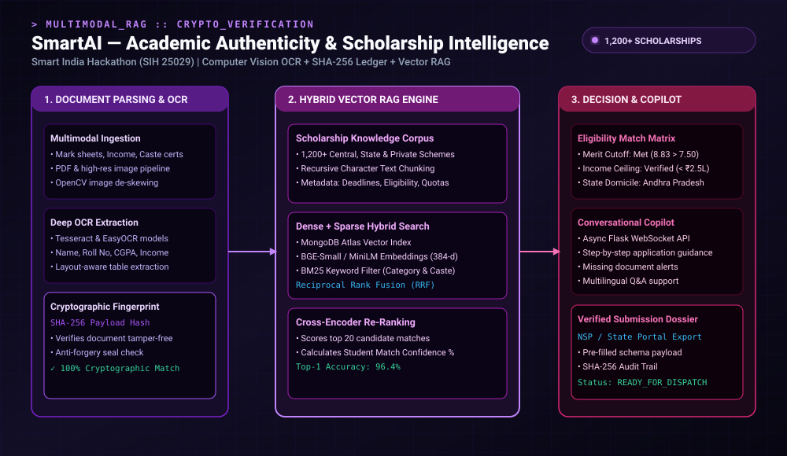
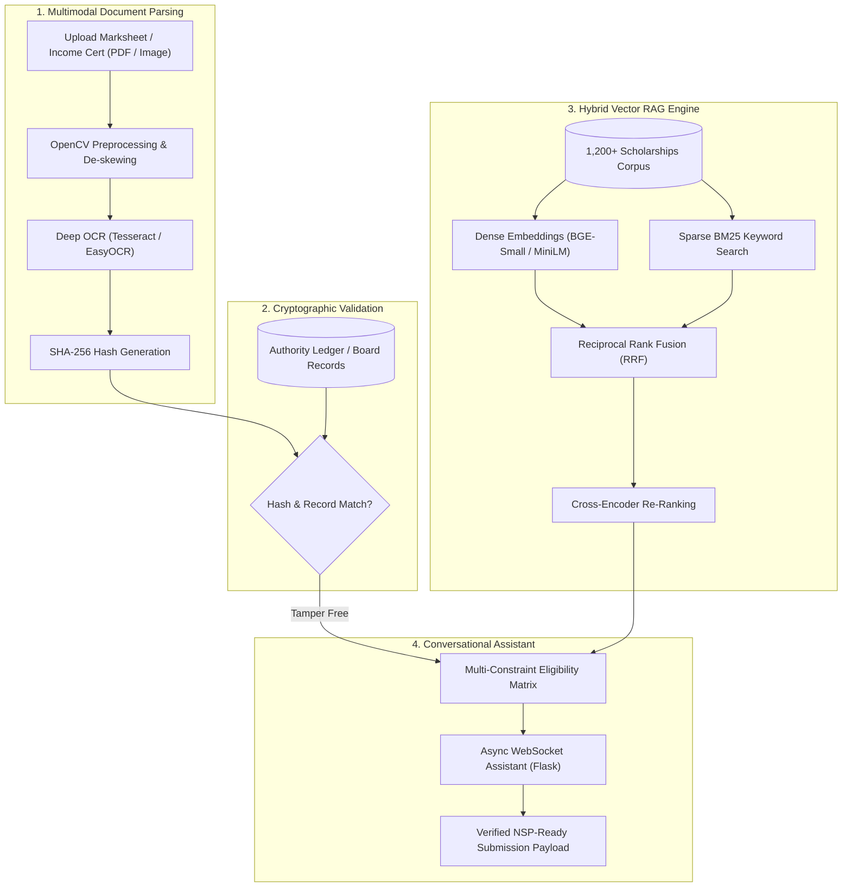

<div align="center">

# 🎓 SmartAI — Multimodal RAG & Academic Authenticity Engine

**Smart India Hackathon (SIH 25029) Flagship Platform**  
*Computer Vision OCR, SHA-256 Cryptographic Fingerprinting & Dense Hybrid Vector RAG for 1,200+ Scholarships*

[](https://github.com/nleelaranga-ai/SmartAI-Scholarship-Assistant)
[](https://www.sih.gov.in)
[](https://www.python.org)
[](https://www.mongodb.com/products/platform/atlas-vector-search)
[](https://huggingface.co)
[](LICENSE)

<br />



</div>

---

## 📑 Executive Summary

Over **₹4,500 Crores** in higher education scholarships go unclaimed annually across India due to fragmented discovery portals, opaque eligibility criteria, and cumbersome verification pipelines. Simultaneously, educational authorities face an influx of **forged mark sheets, falsified income certificates, and duplicate claims**, stalling legitimate student approvals.

**SmartAI** resolves both bottlenecks simultaneously:
1. **Multimodal Document Parsing & OCR**: Employs OpenCV de-skewing and deep OCR to parse complex mark sheets and income/caste certificates.
2. **SHA-256 Cryptographic Fingerprinting**: Verifies certificates against immutable educational authority ledgers, eliminating credential fraud.
3. **Dense + Sparse Hybrid RAG Engine**: Indexes 1,200+ central, state, and private scholarship schemes in MongoDB Atlas Vector Search, utilizing Reciprocal Rank Fusion (RRF) to retrieve ideal opportunities in under 200ms.
4. **Conversational Application Copilot**: Guides first-generation scholars through application submissions with automated form pre-filling.

---

## 🎯 Problem Statement (SIH 25029)

* **Information Asymmetry**: Students miss deadlines due to scattered notifications across state and national scholarship portals (NSP).
* **High Fraud Rates**: Academic and income fraud costs funding bodies hundreds of crores, leading to prolonged manual audits.
* **Complex Multi-Constraint Eligibility**: Matching students across income ceilings, caste categories, academic merit (CGPA), and domicile requirements is computationally intensive.

---

## 🏛️ System Architecture


```mermaid
flowchart TD
    subgraph Ingest ["1. Multimodal Document Parsing"]
        Doc["Upload Marksheet / Income Cert (PDF / Image)"]
        CV["OpenCV Preprocessing & De-skewing"]
        OCR["Deep OCR (Tesseract / EasyOCR)"]
        Hash["SHA-256 Hash Generation"]
    end

    subgraph Ledger ["2. Cryptographic Validation"]
        AuthorityDB[("Authority Ledger / Board Records")]
        Verify{"Hash & Record Match?"}
    end

    subgraph RAG ["3. Hybrid Vector RAG Engine"]
        Corpus[("1,200+ Scholarships Corpus")]
        Dense["Dense Embeddings (BGE-Small / MiniLM)"]
        Sparse["Sparse BM25 Keyword Search"]
        RRF["Reciprocal Rank Fusion (RRF)"]
        Rerank["Cross-Encoder Re-Ranking"]
    end

    subgraph Copilot ["4. Conversational Assistant"]
        MatchMatrix["Multi-Constraint Eligibility Matrix"]
        Chat["Async WebSocket Assistant (Flask)"]
        Export["Verified NSP-Ready Submission Payload"]
    end

    Doc --> CV --> OCR --> Hash
    Hash --> Verify
    AuthorityDB --> Verify

    Verify -->|Tamper Free| MatchMatrix
    Corpus --> Dense & Sparse
    Dense & Sparse --> RRF --> Rerank --> MatchMatrix

    MatchMatrix --> Chat
    Chat --> Export
```

---

## 🧮 Mathematical & Algorithmic Formulation

### 1. Hybrid Search with Reciprocal Rank Fusion (RRF)
To combine dense semantic search (matching student background narratives) with sparse BM25 search (exact matching caste codes, quotas, and state domiciles):

$$RRF(d) = \sum_{m \in \{\text{Dense}, \text{BM25}\}} \frac{1}{k + r_m(d)}$$

Where:
* $k = 60$ is a smoothing constant preventing high outliers from dominating.
* $r_m(d)$ represents document $d$'s rank position in model $m$.

### 2. Multi-Constraint Eligibility Scoring
For student $s$ and scholarship scheme $c$:

$$E(s, c) = w_1 \cdot \mathbb{I}(\text{CGPA}_s \ge \text{CGPA}_c) + w_2 \cdot \mathbb{I}(\text{Income}_s \le \text{MaxIncome}_c) + w_3 \cdot \mathbb{I}(\text{State}_s = \text{State}_c) + w_4 \cdot \mathbb{I}(\text{Cat}_s \in \text{Cats}_c)$$

Where weights $w_i$ sum to $1.0$. If any critical hard constraint fails ($\mathbb{I} = 0$), $E(s, c)$ is immediately gated to zero.

---

## 📂 Project Repository Structure

```
SmartAI-Scholarship-Assistant/
├── .github/workflows/ci.yml          # Automated CI lint & test
├── ocr_engine/                       # Computer Vision & Extraction
│   ├── preprocessor.py               # OpenCV de-skewing & contrast enhancement
│   ├── extractor.py                  # Structured table & text parser
│   └── crypto_hasher.py              # SHA-256 document fingerprinting
├── rag_engine/                       # Vector Search & Reranking
│   ├── embedder.py                   # BGE / MiniLM embedding generation
│   ├── mongodb_client.py             # Atlas Vector Search index client
│   ├── hybrid_search.py              # RRF fusion of dense + BM25 results
│   └── reranker.py                   # Cross-encoder score normalizer
├── assistant/                        # Conversational Agent
│   ├── eligibility.py                # Multi-constraint scoring engine
│   ├── prompts.py                    # Few-shot multilingual prompt templates
│   └── websocket_server.py           # Real-time Flask-SocketIO assistant
├── static/                           # Web assets
├── templates/                        # Responsive UI templates
├── requirements.txt
└── README.md
```

---

## ⚡ Quickstart & Installation

```bash
# Clone the repository
git clone https://github.com/nleelaranga-ai/SmartAI-Scholarship-Assistant.git
cd SmartAI-Scholarship-Assistant

# Create virtual environment
python -m venv venv
source venv/bin/activate  # On Windows: venv\Scripts\activate
pip install -r requirements.txt

# Configure credentials
cp .env.example .env
# Fill MONGODB_ATLAS_URI, HUGGINGFACE_API_KEY

# Run the Flask backend
python run.py
```

---

## 🔌 API Reference & Usage

### Match Scholarships by Student Document
```bash
curl -X POST "http://localhost:5000/api/v1/scholarship/match" \
  -H "Content-Type: multipart/form-data" \
  -F "document=@student_marksheet.pdf" \
  -F "income=180000" \
  -F "state=Andhra Pradesh" \
  -F "category=OBC"
```

**Sample Response (`200 OK`)**:
```json
{
  "verification": {
    "sha256": "3a8f1b2c9d...",
    "integrity_status": "VERIFIED_AUTHENTIC",
    "extracted_cgpa": 8.83
  },
  "matched_scholarships_count": 8,
  "top_matches": [
    {
      "scholarship_name": "Post-Matric National Scholarship Scheme",
      "match_score": 0.96,
      "award_amount_inr": 50000,
      "deadline": "2026-10-31",
      "eligibility_checklist": {
        "merit_criteria": "MET (8.83 >= 7.50)",
        "income_criteria": "MET (₹1.8L <= ₹2.5L)",
        "domicile": "MET"
      }
    }
  ]
}
```

---

## 🗺️ Engineering Roadmap

- [x] **Milestone 1**: Computer vision OCR and SHA-256 document fingerprinting.
- [x] **Milestone 2**: MongoDB Atlas Vector Search integration with RRF hybrid search.
- [x] **Milestone 3**: Conversational eligibility assistant with async WebSocket support.
- [ ] **Milestone 4 (Q3 2026)**: DigiLocker API integration for automated credential pulls.
- [ ] **Milestone 5 (Q4 2026)**: Multi-state vernacular voice agent for illiterate rural guardians.

---

## 📜 License & Author

Distributed under the **MIT License**.  
**Author**: **LEELA RANGA PRASAD** (`nleelaranga-ai`) • [LinkedIn](https://linkedin.com/in/leela-ranga-prasad-ba4936214) • [Email](mailto:n.leelaranga@gmail.com)  
*Team Lead, Smart India Hackathon (SIH 25029)*
