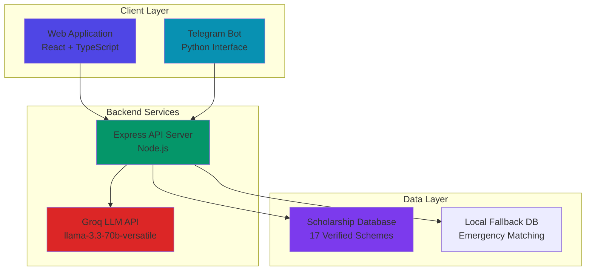
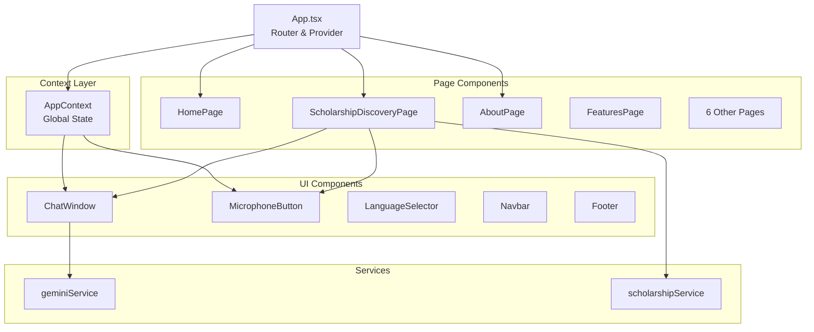

# Design Document

## Overview

SamartAI is implemented as a modern React-based web application with TypeScript, featuring a Node.js/Express backend that integrates with Groq's LLM API. The system employs a dual-platform architecture where the same AI intelligence powers both a rich web interface and a lightweight Telegram bot. The design prioritizes accessibility, multilingual support, and reliability through comprehensive fallback mechanisms.

The platform serves as a bridge between students (particularly from rural and semi-urban areas) and government scholarship opportunities, using conversational AI to eliminate traditional barriers like complex forms, language limitations, and digital literacy requirements.

## Architecture

### High-Level Architecture



### Component Architecture

The frontend follows a component-based architecture with React Context for state management:



## Components and Interfaces

### Frontend Components

#### Core Application Structure
- **App.tsx**: Main application component with HashRouter and AppProvider
- **AppContext.tsx**: Global state management using React Context API
- **types.ts**: TypeScript interfaces for type safety

#### Page Components (9 Routes)
1. **HomePage**: Landing page with hero section and feature overview
2. **ScholarshipDiscoveryPage**: Main chat interface for scholarship discovery
3. **AboutPage**: Platform mission and background information
4. **HowItWorksPage**: Step-by-step usage guide
5. **FeaturesPage**: Detailed feature explanations
6. **AiTechnologyPage**: Technical implementation details
7. **ImpactPage**: Social impact and case studies
8. **FutureRoadmapPage**: Development roadmap and future plans
9. **ContactPage**: Contact information and partnerships

#### UI Components
- **ChatWindow**: Conversation display with message bubbles and timestamps
- **MicrophoneButton**: Voice input activation with visual feedback
- **LanguageSelector**: Dropdown for language switching (EN/TE/HI)
- **Navbar**: Navigation with language selector and route links
- **Footer**: Footer information and links
- **HeroSection**: Landing page hero with call-to-action buttons
- **FeatureCard**: Reusable card component for feature display
- **Button**: Styled button component with variants

### Backend Architecture

#### Express API Server
```typescript
// Core server structure
app.post('/chat', async (req, res) => {
  // 1. Extract user message
  // 2. Process through intent extraction
  // 3. Match against scholarship database
  // 4. Generate AI response via Groq
  // 5. Return formatted response
});
```

#### Intent Extraction System
```typescript
function extractProfile(text: string) {
  return {
    category: // SC/ST/BC/OC detection
    course: // BTech/BCom/Degree/MBA/etc detection
    abroad: // Overseas study detection
  };
}
```

#### Scholarship Matching Engine
```typescript
function matchScholarships(profile: UserProfile) {
  return SCHOLARSHIPS.filter(scholarship =>
    categoryMatches(profile.category, scholarship.category) &&
    courseMatches(profile.course, scholarship.courses)
  );
}
```

### Service Layer

#### Gemini Service (AI Integration)
```typescript
export async function sendMessageToAI(message: string): Promise<string> {
  // Send request to backend /chat endpoint
  // Handle response and error cases
  // Return formatted AI response
}
```

#### Scholarship Service (Local Fallback)
```typescript
export const scholarshipService = {
  searchScholarships: async (query: string): Promise<Scholarship[]> => {
    // Tokenize and clean query
    // Score scholarships based on relevance
    // Return ranked results
  }
};
```

## Data Models

### Core Data Structures

#### Scholarship Interface
```typescript
interface Scholarship {
  id: string;
  name: string;
  category: string; // SC/ST/BC/OC/Minority/Brahmin/etc
  incomeLimit: number; // in INR
  description: string;
  applyLink: string;
  eligibilityCriteria?: string[];
  documentsRequired?: string[];
  deadline?: string;
}
```

#### Chat Message Interface
```typescript
interface ChatMessage {
  id: string;
  type: 'user' | 'ai' | 'system';
  text: string;
  timestamp: string;
  isStreaming?: boolean;
  spokenAudioUrl?: string;
  functionCall?: any;
  groundingSources?: GroundingSource[];
}
```

#### Application Context Interface
```typescript
interface AppContextType {
  selectedLanguage: Language; // 'en' | 'te' | 'hi'
  setSelectedLanguage: (lang: Language) => void;
  messages: ChatMessage[];
  setMessages: React.Dispatch<React.SetStateAction<ChatMessage[]>>;
  addMessage: (message: Omit<ChatMessage, 'id' | 'timestamp'>) => void;
  isLoading: boolean;
  setIsLoading: (loading: boolean) => void;
  isRecording: boolean;
  setIsRecording: (recording: boolean) => void;
  error: string | null;
  setError: (error: string | null) => void;
}
```

### Scholarship Database Structure

The system maintains 17 verified government scholarships organized by categories:

1. **General Schemes (3)**:
   - Jagananna Vidya Deevena (Fee Reimbursement)
   - Jagananna Vasathi Deevena (Hostel Support)
   - Ambedkar Overseas Vidya Nidhi (Study Abroad)

2. **Brahmin Welfare (4)**:
   - Bharati Scheme - Graduation
   - Bharati Scheme - Professional
   - Veda Vyasa Scheme
   - Bharati Scheme (CA/ICWA)

3. **Special Categories (3)**:
   - BOC Workers Children Scholarship
   - Sanction of Laptops (Differently Abled)
   - Motorized Three Wheelers (Differently Abled)

4. **Additional Support (7)**:
   - NSP Post Matric Scholarship (Minority)
   - Daisy Players (Visually Challenged)
   - Various other specialized schemes

### Multilingual Content Structure

```typescript
const USER_MESSAGES = {
  en: { /* English translations */ },
  te: { /* Telugu translations */ },
  hi: { /* Hindi translations */ }
};
```

The system maintains comprehensive translations for all UI elements, supporting:
- Navigation labels
- Feature descriptions
- Chat interface text
- Error messages
- Help text and examples

## Correctness Properties

*A property is a characteristic or behavior that should hold true across all valid executions of a system—essentially, a formal statement about what the system should do. Properties serve as the bridge between human-readable specifications and machine-verifiable correctness guarantees.*

Let me analyze the acceptance criteria to determine which ones are testable as properties.

<function_calls>
<invoke name="prework">
<parameter name="featureName">samartai-platform

### Property Reflection

After analyzing all acceptance criteria, I identified several areas where properties can be consolidated for better testing efficiency:

**Redundancy Analysis:**
- Properties 2.1 and 6.1-6.5 all relate to message processing and can be combined into comprehensive chat functionality properties
- Properties 3.1-3.5 all relate to voice input and can be consolidated into voice system properties  
- Properties 4.2-4.5 all relate to language system behavior and can be combined
- Properties 5.2-5.5 all relate to scholarship database validation and can be consolidated
- Properties 9.1-9.5 all relate to error handling and can be combined into resilience properties

**Final Property Set:**
After consolidation, the following properties provide comprehensive coverage without redundancy:

### Correctness Properties

**Property 1: Responsive Design Consistency**
*For any* screen size and device type, all UI elements should render properly and maintain usability across mobile and desktop viewports
**Validates: Requirements 1.2**

**Property 2: Route Accessibility**
*For any* of the 9 defined routes, navigation should work correctly and pages should render without errors
**Validates: Requirements 1.3**

**Property 3: Theme Consistency**
*For any* page in the application, the dark theme with gradient backgrounds should be consistently applied
**Validates: Requirements 1.5**

**Property 4: Chat Message Processing**
*For any* user message sent through the chat interface, the system should process it through the appropriate backend (Groq or fallback) and return a valid response
**Validates: Requirements 2.1, 2.2**

**Property 5: Chat Interface Behavior**
*For any* chat interaction, messages should appear with timestamps, loading indicators should show during processing, and markdown formatting should render correctly
**Validates: Requirements 2.3, 2.4, 2.5**

**Property 6: Voice Input System**
*For any* voice input interaction, the Web Speech API should activate correctly, provide visual feedback, transcribe speech to text, and handle errors gracefully
**Validates: Requirements 3.1, 3.2, 3.3, 3.4, 3.5**

**Property 7: Language System Behavior**
*For any* language change operation, the selection should persist across sessions, all UI text should update immediately, native scripts should display correctly, and translations should be consistent across pages
**Validates: Requirements 4.2, 4.3, 4.4, 4.5**

**Property 8: Scholarship Database Integrity**
*For any* scholarship in the database, it should have complete information (eligibility, amounts, application links) and belong to the correct category with appropriate tags
**Validates: Requirements 5.2, 5.3, 5.4, 5.5**

**Property 9: AI Backend Intelligence**
*For any* user query, the AI backend should extract relevant profile information, match against eligibility criteria, provide scored rankings, ask follow-up questions when needed, and handle natural language input
**Validates: Requirements 6.1, 6.2, 6.3, 6.4, 6.5**

**Property 10: Platform Consistency**
*For any* identical query sent to both web and Telegram platforms, the scholarship information returned should be consistent
**Validates: Requirements 7.2**

**Property 11: Conversation State Management**
*For any* platform (web or Telegram), user context and conversation history should be maintained separately and correctly
**Validates: Requirements 7.4**

**Property 12: System Resilience**
*For any* service failure or error condition, the system should provide appropriate fallbacks, display clear error messages, maintain stability, show loading states, and preserve core functionality
**Validates: Requirements 9.1, 9.2, 9.3, 9.4, 9.5**

**Property 13: Accessibility Compliance**
*For any* user interaction method (keyboard, touch, screen reader), the interface should remain fully functional and accessible
**Validates: Requirements 10.2, 10.3, 10.4**

## Error Handling

### Frontend Error Handling

#### Network Error Management
```typescript
// Graceful degradation when backend is unavailable
try {
  const aiReply = await sendMessageToAI(userQuery);
  addMessage({ type: "ai", text: aiReply });
} catch (error) {
  // Fallback to local scholarship matching
  const results = await scholarshipService.searchScholarships(userQuery);
  if (results.length > 0) {
    const reply = formatFallbackResponse(results);
    addMessage({ type: "ai", text: reply });
  } else {
    addMessage({
      type: "ai",
      text: "⚠️ AI is temporarily unavailable. Please try again."
    });
  }
}
```

#### Voice Recognition Error Handling
```typescript
recognition.onerror = (event) => {
  setIsRecording(false);
  switch (event.error) {
    case 'no-speech':
      setError(messages.noSpeechDetected);
      break;
    case 'network':
      setError('Network error. Please check your connection.');
      break;
    default:
      setError(messages.speechRecognitionError);
  }
};
```

#### State Management Error Boundaries
- React Error Boundaries wrap critical components
- Context state includes error tracking
- Loading states prevent user confusion during async operations
- Timeout handling for long-running operations

### Backend Error Handling

#### API Error Management
```typescript
app.post("/chat", async (req, res) => {
  try {
    // Main processing logic
  } catch (err) {
    console.error(err);
    res.json({ 
      reply: "Server error. Please try again.",
      fallback: true 
    });
  }
});
```

#### Groq API Fallback Strategy
```typescript
// Primary: Groq LLM API
const groqResponse = await fetch("https://api.groq.com/openai/v1/chat/completions", {
  // API call configuration
});

if (!data.choices) {
  console.error("Groq error:", data);
  return res.json({ 
    reply: "AI is temporarily unavailable.",
    shouldUseFallback: true 
  });
}
```

#### Input Validation and Sanitization
- Message length limits to prevent abuse
- Input sanitization to prevent injection attacks
- Rate limiting to prevent spam
- Graceful handling of malformed requests

### Error Recovery Strategies

1. **Progressive Degradation**: Core functionality remains available even when advanced features fail
2. **Automatic Retry**: Transient network errors trigger automatic retry with exponential backoff
3. **User Feedback**: Clear error messages guide users on how to proceed
4. **Fallback Systems**: Local scholarship matching when AI backend is unavailable
5. **State Recovery**: Application state is preserved across error conditions

## Testing Strategy

### Dual Testing Approach

The SamartAI platform employs both unit testing and property-based testing for comprehensive coverage:

**Unit Tests**: Focus on specific examples, edge cases, and integration points
- Component rendering and interaction
- Service function behavior with known inputs
- Error condition handling
- API endpoint responses
- Database query results

**Property Tests**: Verify universal properties across all inputs
- Chat interface behavior with random messages
- Voice input system with various speech patterns
- Language switching with different content
- Scholarship matching with diverse user profiles
- Error handling with simulated failures

### Property-Based Testing Configuration

**Testing Framework**: Jest with fast-check for property-based testing
**Minimum Iterations**: 100 per property test
**Test Tagging**: Each property test references its design document property

Example property test structure:
```typescript
// Feature: samartai-platform, Property 4: Chat Message Processing
test('chat processes any valid message correctly', () => {
  fc.assert(fc.property(
    fc.string({ minLength: 1, maxLength: 500 }),
    async (message) => {
      const response = await sendMessageToAI(message);
      expect(response).toBeDefined();
      expect(typeof response).toBe('string');
      expect(response.length).toBeGreaterThan(0);
    }
  ), { numRuns: 100 });
});
```

### Testing Coverage Areas

1. **Frontend Component Testing**
   - React component rendering
   - User interaction handling
   - State management behavior
   - Responsive design validation

2. **Backend API Testing**
   - Endpoint functionality
   - Error handling
   - Data validation
   - Integration with external services

3. **Integration Testing**
   - End-to-end user flows
   - Cross-platform consistency
   - Service integration points
   - Database operations

4. **Accessibility Testing**
   - Keyboard navigation
   - Screen reader compatibility
   - ARIA label validation
   - Touch interaction support

5. **Performance Testing**
   - Load time measurements
   - Bundle size optimization
   - API response times
   - Memory usage monitoring

### Test Environment Setup

**Development**: Local testing with mocked services
**Staging**: Full integration testing with real APIs
**Production**: Monitoring and error tracking

The testing strategy ensures that both specific functionality (unit tests) and general system behavior (property tests) are thoroughly validated, providing confidence in the platform's reliability and correctness.